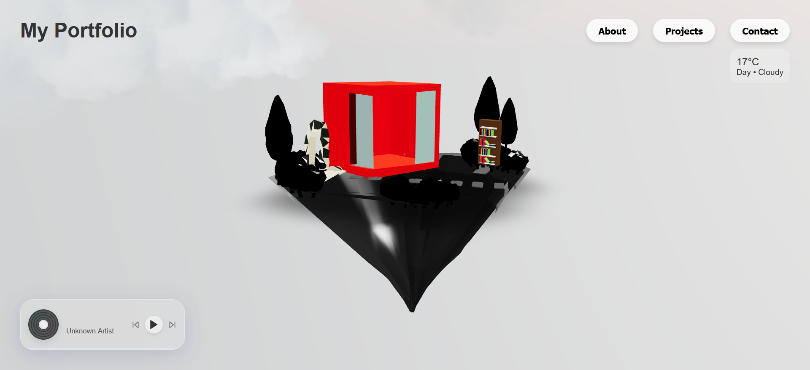

# 🪐 3D Island Portfolio — "The Dev's Sky-Lab" (Work In Progress 🚧)

An interactive, immersive 3D portfolio website designed to showcase developer skills, projects, and infrastructure. Built using modern web graphics technologies, this project translates code into a living 3D environment.

---

## 📸 Preview



*Current build featuring dynamic weather tracking and glassmorphism audio overlay.*

---

## 🚀 Tech Stack

* **Frontend & Core:** React, TypeScript, Vite
* **3D Graphics:** Three.js, `@react-three/fiber` (R3F), `@react-three/drei`
* **Styling & UI:** Tailwind CSS (Glassmorphism design)
* **Animations:** GSAP / Framer Motion

---

## 🗺️ Current Roadmap & Features

- [x] **3D Canvas & Environment Setup:** Optimized lighting with custom contact shadows and reflection maps.
- [x] **Custom Low-Poly Assets:** Integration of modular `.glb` 3D models (Floating Island architecture).
- [x] **WASD/Arrow Character Controller:** Dynamic key-listening for real-time mesh navigation.
- [x] **Dynamic Weather Widget:** Live environment tracking overlay (`12°C Day • Cloudy`).
- [x] **Frosted Glass Audio Player:** Interactive context-aware UI widget for background lo-fi tracks.
- [ ] **Fly-to Camera Navigation:** Animated cinematic zoom into specific assets on click (e.g., GitHub portal).
- [ ] **Day/Night Toggle Cycle:** Emissive materials (neon glows) activation based on environment state.
- [ ] **The "Matrix Glitch" Easter Egg:** Custom wireframe material shift logic when triggering hidden interactions.

---

## 🛠️ Local Development

To run this project locally, clone the repository and execute the following commands:

```bash
# Clone the repository
git clone [https://github.com/XPPET/3d-island-portfolio.git](https://github.com/XPPET/3d-island-portfolio.git)

# Install dependencies
npm install

# Start the local development server
npm run dev
